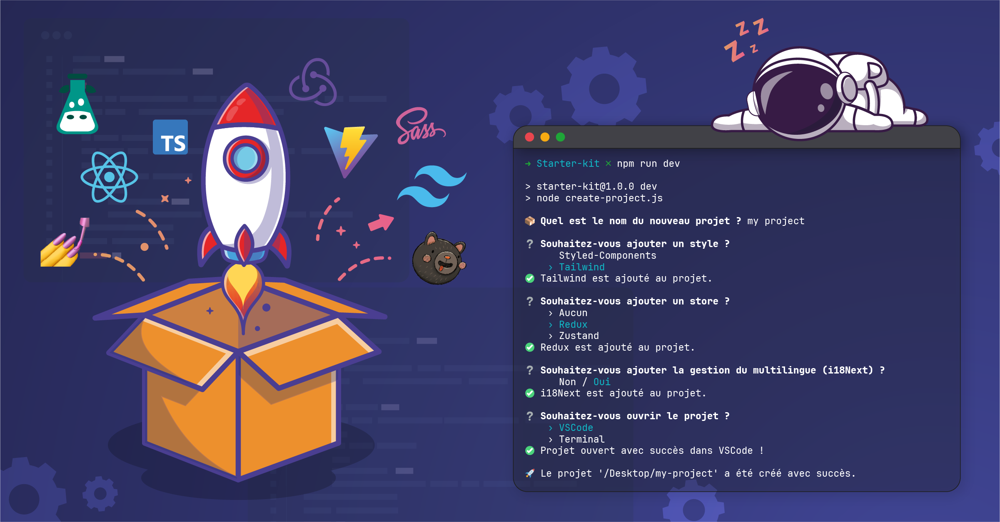

# 🧨 Starter Kit - eLeGarage

Ce **starter kit** est un générateur de projet React qui permet de démarrer rapidement un projet en intégrant le sbibliothèques usuelles.
Il s'appuie sur le bundler Vite / React + Typescript.



## 🚀 Fonctionnalités

- Initialisation d'un projet React (Vite) avec TypeScript
- Gestion de différents styles (Styled Components ou Tailwind CSS)
- Choix du store entre "Redux" / "Zustand" pour la gestion de l'état global _(option)_
- Gestion du Multilingue avec i18Next _(option)_
- Ouverture du nouveau projet dans VSCode ou Terminal _(option)_
- Configuration prête à l'emploi pour ESLint et Prettier

## 📋 Prérequis

- [Node.js](https://nodejs.org/) (v14 ou plus)
- [npm](https://www.npmjs.com/)

## 💻 Installation

1. Clonez le dépôt :

   ```bash
   git clone https://github.com/lesimpleliott/Starter-kit.git
   ```

2. Naviguez dans le dossier du projet et installez les dépendances :

   ```bash
   cd Starter-kit
   npm install
   ```

## ⚙️ Utilisation

### Création d'un projet React

1. Pour démarrer un nouveau projet React, exécutez la commande suivante :

   ```bash
   npm run dev
   ```

2. Suivez les instructions dans le terminal pour nommer votre projet et choisir vos configurations de store et de styles.

### Options disponibles lors de l'exécution :

#### Choix de la gestion de l'état :

- **Aucun** : Pas de gestion d'état. _Option par defaut_
- **Zustand** : Ajout de Zustand avec des exemples de store.
- **Redux** : Ajout de Redux avec un slice d'exemple.

#### Choix de styles :

- **Styled Components** : Ajoute les fichiers nécessaires pour Styled Components.
- **Tailwind CSS** : Ajoute les fichiers de configuration pour Tailwind CSS. _Option par defaut_

#### Ajout du multilingue :

- _Non_ : Pas de gestion du multilingue. _Option par defaut_
- _Oui_ / **i18Next** : Gestion et installation du multilingue avec i18Next.

#### Ouverture du projet :

- **VSCode** : Ouvre le projet dans Visual Studio Code. _Option par defaut_
- **Terminal** : Ouvre le projet dans un nouveau Terminal.
- **Nope** : N'ouvre pas le projet.

### Exemple de création d'un projet avec Redux et Styled Components :

```bash
npm run dev
```

L'application vous demandera de sélectionner **Redux** pour le store et **Tailwind** pour le style.
Le projet généré inclura un fichier store.ts et un exemple de slice, ainsi que les fichiers de style de base pour utiliser Tailwind avec Prettier.

## 📂 Structure du Projet

Voici un aperçu de la structure du projet **Starter-Kit**

```bash
starter-kit
├── features/                     # Contient les scripts principaux pour configurer le projet
│    ├── addMultiligual.js        # Ajoute la gestion du multilingue au projet avec i18Next
│    ├── addStore.js              # Ajoute un store (Redux ou Zustand) au projet
│    ├── addStyle.js              # Ajoute les fichiers de style (Styled Components ou Tailwind CSS)
│    ├── askProjectName.js        # Gère l'interaction pour nommer le projet
│    ├── createFolder.js          # Crééer le dossier du projet sur le "Desktop"
│    └── openProject.js           # Ouvre le nouveau projet dans VSCode ou Terminal
├── template/                     # Fichiers modèles utilisés pour générer le projet
│    ├── LibrairiesFiles/         # Contient les templates pour les librairies disponibles
│    └── ReactApp/                # Structure de base d'un projet React TypeScript
├── utils/                        # Scripts utilitaires pour la gestion du projet
│    ├── copyTemplateFile.js      # Fonctions pour copier les templates avec copyTemplateDirectory() ou copyTemplateFile()
│    ├── copyTemplateReactApp.js  # Fonctions pour copier le template de base de React
│    ├── updatePackageJSON.js     # Fonction pour mettre à jour le package.json
│    └── updateTsx.js             # Fonction pour ajouter des éléments aux fichiers .tsx du dossier React
├── create-project.js             # Script principal pour démarrer la création du projet
├── package-lock.json
├── package.json
└── README.md

```

### Détails des dossiers principaux :

- **features/** : Contient les scripts principaux pour ajouter un store, des styles etc.
- **template/** : Contient les fichiers modèles utilisés pour créer le projet final, comme les fichiers Redux, Styled Components, etc.
- **utils/** : Contient des fonctions utilitaires pour copier les fichiers ou mettre à jour les dépendances du projet.

## 📦 Librairies utilisées

Ce projet utilise les bibliothèques suivantes avec leurs versions respectives :

### Dépendances :

- **React** : ^18.2.0
- **React DOM** : ^18.2.0
- **React Router DOM** : ^6.26.2
- **React Redux** : ^9.1.2
- **Redux Toolkit** : ^2.2.7
- **Zustand** : ^4.5.5
- **Styled Components** : ^6.1.13
- **i18next**: "^23.14.0",
- **react-i18next**: "^15.0.1",

### Dépendances de développement :

- **@types/react** : ^18.2.66
- **@types/react-dom** : ^18.2.22
- **@typescript-eslint/eslint-plugin** : ^7.2.0
- **@typescript-eslint/parser** : ^7.2.0
- **@vitejs/plugin-react** : ^4.2.1
- **ESLint** : ^8.57.0
- **ESLint Plugin React Hooks** : ^4.6.0
- **ESLint Plugin React Refresh** : ^0.4.6
- **TypeScript** : ^5.2.2
- **Vite** : ^5.2.0
- **TailwindCSS** : ^3.4.10
- **Autoprefixer** : ^10.4.20
- **PostCSS** : ^8.4.45
- **Prettier** : ^3.3.3
- **Prettier Plugin TailwindCSS** : ^0.6.6
- **Sass** : ^1.78.0

## 🔄 Mise à jour des librairies

Il est important de garder les dépendances à jour pour bénéficier des dernières fonctionnalités, optimisations et corrections de bugs. Voici comment vérifier si une mise à jour est nécessaire et comment l'effectuer.

### Vérifier les mises à jour disponibles

Pour lister les librairies qui ne sont pas à jour, exécute la commande suivante :

```bash
npm outdated
```

Cette commande te donnera une vue d'ensemble des versions actuellement installées, des versions souhaitées, et des versions les plus récentes disponibles.

Par exemple, si tu vois quelque chose comme ceci pour Zustand :

```bash
Package     Current  Wanted  Latest  Location
zustand     4.5.5    4.5.5   4.6.0   node_modules/zustand
```

Cela signifie que la version actuelle de Zustand est la **4.5.5**, et la version la plus récente disponible est la **4.6.0**.

### Mettre à jour une librairie

Pour mettre à jour Zustand vers sa dernière version, exécute simplement la commande suivante :

```bash
npm install zustand@latest
```

Cela mettra à jour Zustand vers la version la plus récente, indiquée dans la colonne Latest.

Si tu souhaites mettre à jour toutes les dépendances en une seule fois, tu peux exécuter :

```bash
npm update
```

Cependant, il est recommandé de vérifier manuellement les changements apportés par les nouvelles versions, en particulier pour les mises à jour majeures, qui peuvent introduire des breaking changes.

## 🤝 Contributions

Les contributions sont les bienvenues ! Si vous souhaitez améliorer ce projet, veuillez suivre les étapes suivantes :

1. Fork le projet
2. Créez une nouvelle branche (git checkout -b feature-amazing-feature)
3. Committez vos changements (git commit -m 'Add some amazing feature')
4. Poussez votre branche (git push origin feature-amazing-feature)
5. Ouvrez une Pull Request

## 📝 Licence

Ce projet est sous licence MIT
